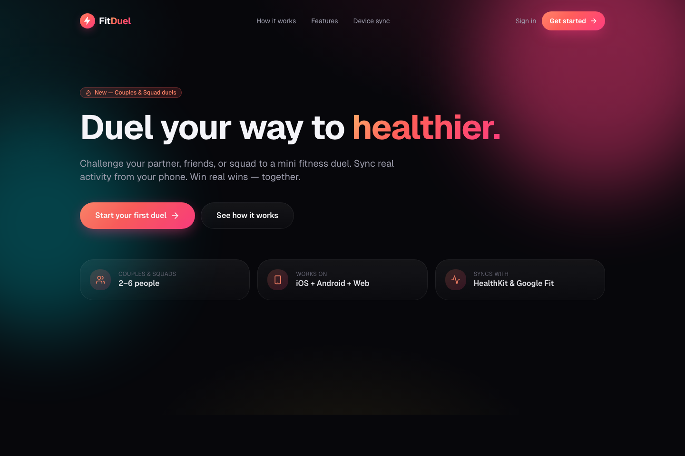
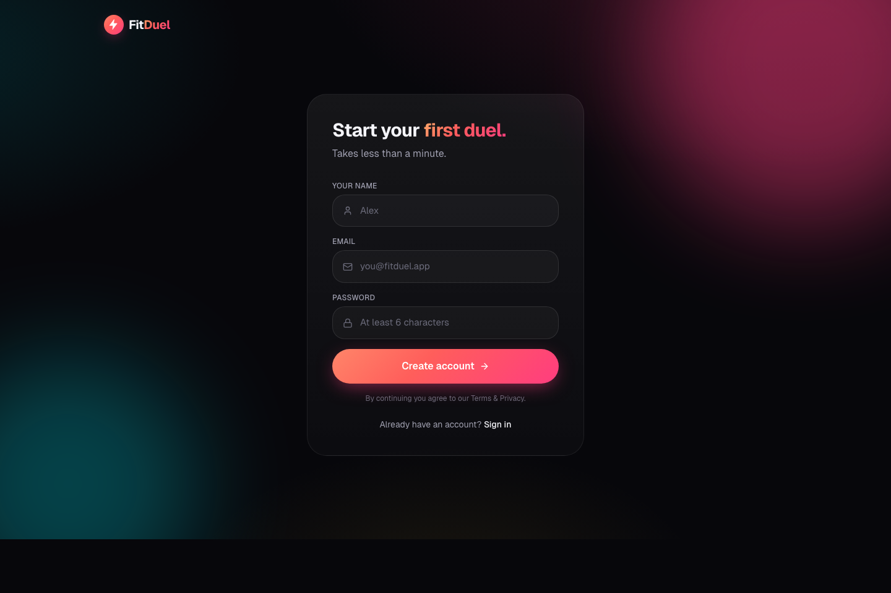
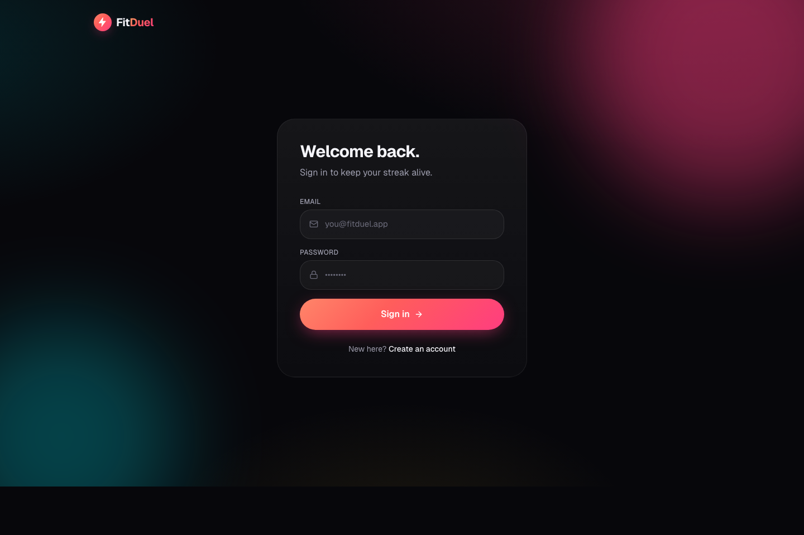

<div align="center">

# 🔥 FitDuel

**Duel your way to healthier.**
Challenge your partner or squad. Sync real fitness data. Win real wins — together.

[](https://fitduel-xi.vercel.app)
[](LICENSE)
[](https://nextjs.org/)
[](https://www.typescriptlang.org/)
[](https://supabase.com/)
[](https://tailwindcss.com/)

<br />

<a href="https://fitduel-xi.vercel.app"></a>

</div>

---

## ✨ What is FitDuel?

A cross-platform fitness challenge app where couples (2) or squads (3–6) compete on **fair** progress — by **% of their own goal**, not raw kilograms — so a 60 kg partner vs a 90 kg partner still makes for a fair duel.

**You can:**

- 👥 Start a **Couple** or **Squad** duel for 7, 30, or 90 days
- 🔗 Share a **one-tap invite link** — join from any phone or browser
- ⚖️ Log weight in **kg or lbs** (pick your unit; the DB stores kg)
- 🏆 See a **live leaderboard** calculated from real weigh-ins
- 🔥 Build a **streak** from daily activity entries
- 💸 Set **stakes** — loser plans date night, winner picks the charity, whatever you want

> 🚀 **Try it live:** [fitduel-xi.vercel.app](https://fitduel-xi.vercel.app) — takes 60 seconds to sign up and start your first duel.

---

## 📸 Screenshots

| Landing | Signup | Login | Setup guard |
| :---: | :---: | :---: | :---: |
|  |  |  |  |

> More views (dashboard, duel leaderboard, progress charts) are easier to see live than static — sign up at the [live demo](https://fitduel-xi.vercel.app) and explore.

---

## 🧱 Tech Stack

| Layer | Choice | Why |
| --- | --- | --- |
| Framework | **Next.js 16** (App Router, Turbopack) | Server components + server actions → minimal client JS |
| Language | **TypeScript 5** strict | Type-safe across the data layer |
| Styling | **Tailwind CSS v4** + custom tokens | Polished dark theme, zero runtime cost |
| Animation | **Framer Motion** | Spring transitions, stagger, shared-layout tab bar |
| Icons | **lucide-react** | Crisp, tree-shakable |
| Database | **Supabase Postgres** | RLS from day one, generous free tier |
| Auth | **Supabase Auth** (email / password) | Email verification optional |
| Hosting | **Vercel** | Zero-config deploys, edge CDN |
| PWA | **Manifest + dynamic viewport** | Installable on iOS + Android home screens |

---

## 🚀 Quick start (local dev)

### Prerequisites
- **Node.js ≥ 20.9** ([install](https://nodejs.org))
- A free **Supabase project** ([create one](https://supabase.com/dashboard/new))

### 1. Clone & install

```bash
git clone https://github.com/svrohith9/fitduel.git
cd fitduel
npm install
```

### 2. Set environment variables

Copy the template and fill in your Supabase values:

```bash
cp .env.example .env.local
```

Your `.env.local` should look like:

```bash
NEXT_PUBLIC_SUPABASE_URL=https://<your-project-ref>.supabase.co
NEXT_PUBLIC_SUPABASE_PUBLISHABLE_KEY=sb_publishable_...
# OR the legacy anon key — either works:
# NEXT_PUBLIC_SUPABASE_ANON_KEY=eyJhbGc...
```

Where to find these:
- **Supabase Dashboard** → your project → **Project Settings → API**

### 3. Create the database schema

In your Supabase project, open **SQL Editor → New Query**, then **paste and run** both files (in order):

1. [`supabase/schema.sql`](supabase/schema.sql) — tables + RLS policies
2. [`supabase/auth_trigger.sql`](supabase/auth_trigger.sql) — auto-creates a `profiles` row on signup

Also, in **Authentication → Providers → Email**, toggle **"Confirm email"** OFF for the fastest dev loop (you can re-enable later).

### 4. Run

```bash
npm run dev
# → http://localhost:3000
```

---

## 🌍 Deploy your own

**One-click Vercel deploy:**

[](https://vercel.com/new/clone?repository-url=https%3A%2F%2Fgithub.com%2Fsvrohith9%2Ffitduel&env=NEXT_PUBLIC_SUPABASE_URL,NEXT_PUBLIC_SUPABASE_PUBLISHABLE_KEY&envDescription=Supabase%20URL%20and%20publishable%20key%20from%20your%20Supabase%20project%20settings&envLink=https%3A%2F%2Fgithub.com%2Fsvrohith9%2Ffitduel%232-set-environment-variables)

Or via CLI:

```bash
npm i -g vercel
vercel --prod
```

Add the two env vars in the Vercel dashboard → **Project Settings → Environment Variables**.

---

## 🗂 Project structure

```
fitduel/
├─ src/
│  ├─ app/
│  │  ├─ page.tsx                # Landing
│  │  ├─ setup/                  # Shown when Supabase env vars are missing
│  │  ├─ (auth)/login            # Login (server action)
│  │  ├─ (auth)/signup           # Signup (server action)
│  │  ├─ onboarding/             # Set start + goal weight
│  │  ├─ invite/[code]/          # Accept an invite link
│  │  └─ dashboard/
│  │     ├─ layout.tsx           # Auth-gated shell + tab bar
│  │     ├─ page.tsx             # Home — greeting, streak, today, duels
│  │     ├─ duels/
│  │     │  ├─ page.tsx          # Active + past duels
│  │     │  ├─ new/page.tsx      # Create a duel
│  │     │  └─ [id]/page.tsx     # Detail: leaderboard, invite share, log weight
│  │     ├─ progress/page.tsx    # Weight ring, weekly chart, averages
│  │     ├─ group/page.tsx       # Squad roster + primary leaderboard
│  │     └─ profile/page.tsx     # Edit profile + unit toggle + sign out
│  ├─ components/
│  │  ├─ ui/                     # Button, Input, Card, Avatar, Badge, WeightInput, ProgressRing, Logo, SubmitButton, FormError
│  │  ├─ motion/                 # FadeUp, Stagger, StaggerItem
│  │  └─ dashboard/              # TabBar, DuelCard, StatsTile, LogToday, LogWeightInline, InviteShare
│  └─ lib/
│     ├─ utils.ts                # cn, formatWeight, kg↔lbs, streak helpers
│     ├─ types.ts                # Profile, Duel, Standing, …
│     ├─ env.ts                  # isSupabaseConfigured()
│     └─ supabase/
│        ├─ client.ts            # Browser client
│        ├─ server.ts            # Server client (async cookies)
│        ├─ middleware.ts        # Session refresh
│        ├─ queries.ts           # Typed server queries
│        └─ actions.ts           # Server actions (auth, duels, weigh-ins, …)
├─ supabase/
│  ├─ schema.sql                 # Tables + RLS policies
│  ├─ auth_trigger.sql           # handle_new_user() trigger + backfill
│  └─ migrations/                # Incremental migrations
├─ public/                       # PWA manifest, icon
├─ proxy.ts                      # Next.js 16 middleware (session refresh)
└─ docs/screenshots/             # README images
```

---

## 🔐 Security model

- **Row-Level Security on every table.** Users can only read/write their own data (weigh-ins, activities) or data from duels they're a participant in.
- **Invite-by-code**, not by user search — you can't enumerate other users.
- **Publishable (anon) key is public by design** — Supabase's RLS is the real security boundary.
- **No service_role key in the client.** Server actions run with the user's JWT.

See [`supabase/schema.sql`](supabase/schema.sql) for every policy.

---

## 🗺 Roadmap

- [ ] **Capacitor wrapper** → real iOS + Android apps with HealthKit and Google Fit auto-sync
- [ ] **Streak Shields** — partners can gift a shield to protect a missed day
- [ ] **Daily mini-duels** — auto "first to 10k steps" among duel members
- [ ] **Push notifications** for streaks and partner activity
- [ ] **Group chat** scoped to each duel
- [ ] **Apple Watch / Wear OS** complications

Want to pick one up? Open an issue — PRs welcome.

---

## 🤝 Contributing

Pull requests are welcome! Please read [`CONTRIBUTING.md`](CONTRIBUTING.md) for the workflow, coding style, and how to run the test suite locally. For big changes, open an issue first so we can align on the approach.

By participating, you agree to uphold our [Code of Conduct](CODE_OF_CONDUCT.md).

---

## 🐛 Reporting issues

Use the [issue templates](.github/ISSUE_TEMPLATE). Please search existing issues first.

Security vulnerabilities? See [SECURITY.md](SECURITY.md) — please do **not** open a public issue.

---

## 📜 License

[MIT](LICENSE) © 2026 FitDuel Authors

---

<div align="center">

Built to move. 🏃‍♀️🏃‍♂️ &nbsp;·&nbsp; [Live demo](https://fitduel-xi.vercel.app) &nbsp;·&nbsp; [Report a bug](https://github.com/svrohith9/fitduel/issues/new?template=bug_report.yml) &nbsp;·&nbsp; [Request a feature](https://github.com/svrohith9/fitduel/issues/new?template=feature_request.yml)

</div>
